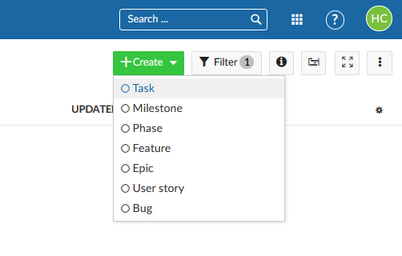
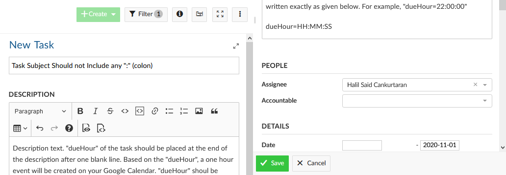
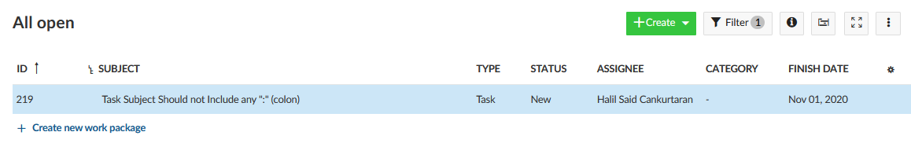

# How to Create a Task to Synchronize
## Steps:
1. Log into your OpenProject account and go to the work packages page.
2. Click, "+Create" button on the right upper side of the page.
3. Enter a task subject. The subject should not include any ":" (colons).
4. Specify the description of the task, then, press enter and start a new line.
    * If the first line includes only three "!" ("!!!"), it will not be synchronized!
    * To clarify, the first line should be in the form of "!!!\\n" to not to synchronize
5. Specify the time that you want to create your task on the Calendar as below:
    * dueHour=HH:MM:SS
    * For example, it should be "22:00:00" to create an event between 10 pm--11 pm.
6. Tasks should be assigned to one of the members.
    * If not, 'Not assigned to anyone' will be written into the explanation of the event.
7. Specify the “Finish Date” of the task.
    * If "Finish Date" is not specified, an event will be set on the creation time of the task.
8. If you get an error, please check the whether requirements are satisfied or not.
9. Refer to the following pages for an example of task creation.

## Create a Task on OpenProject

## Fill in the Details of the Task

## An Example Task After Creation
